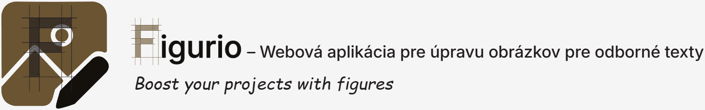
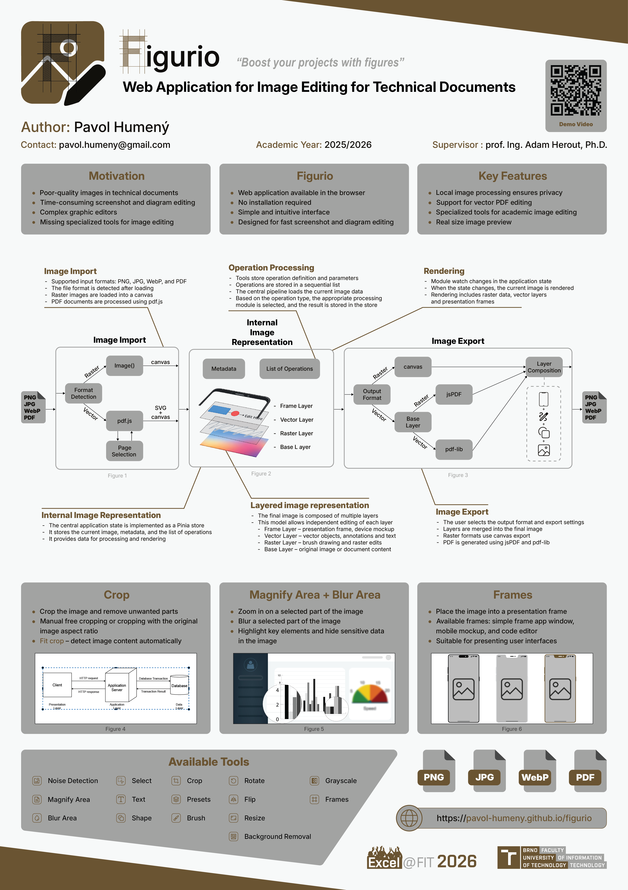
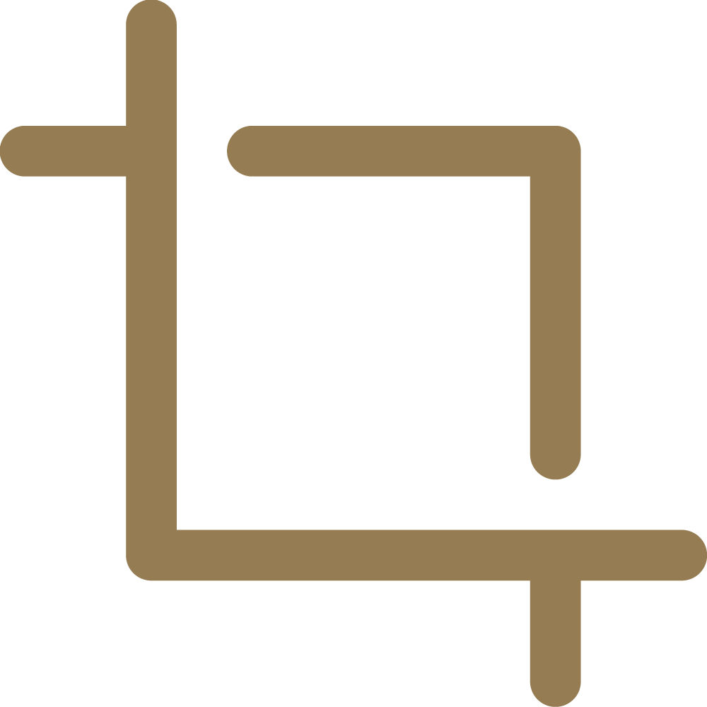
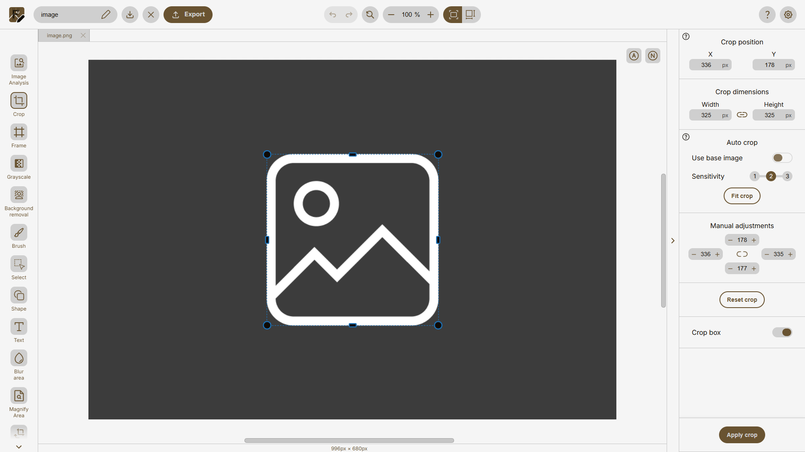
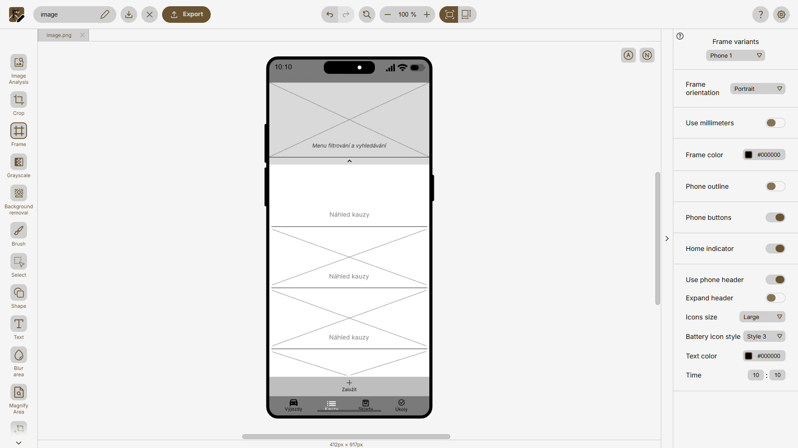
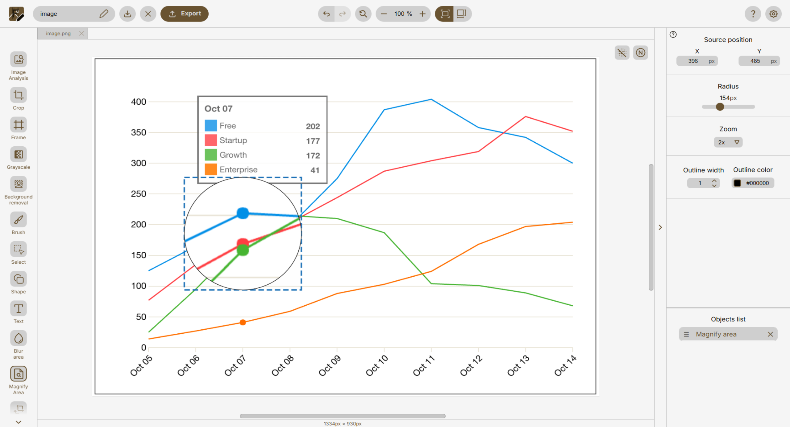
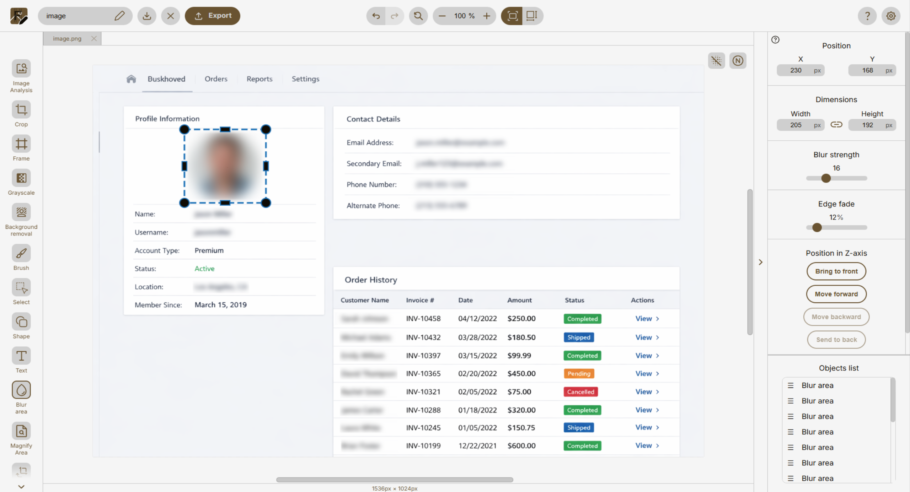

<p align="center">
  
</p>

# Figurio

**Figurio** je webový editor obrázkov určený na prípravu snímok obrazovky, diagramov a ilustrácií do akademických a technických dokumentov. Zameriava sa na rýchlu úpravu vizuálneho obsahu bez potreby používania komplexného grafického softvéru.

Aplikácia poskytuje nástroje na orezanie, zvýraznenie detailov, pridávanie anotácií a aplikovanie prezentačných rámov zariadení. Je navrhnutá s dôrazom na prehľadné používateľské rozhranie, konzistentný pracovný postup a efektívnu prípravu obrázkov vhodných pre LaTeX, technické správy a vedecké publikácie.

Figurio funguje priamo v prehliadači bez nutnosti inštalácie. Spracovanie obrázkov prebieha lokálne na strane klienta, čo zvyšuje ochranu súkromia a bezpečnosť spracovávaných dát.

**Verejne dostupná verzia aplikácie:** https://pavol-humeny.github.io/figurio/

---

# Autor

**Pavol Humeny**  
**E-mail:** pavol.humeny@gmail.com  
Vysoké učení technické v Brně - Fakulta informačných technológií  

Projekt vznikol ako súčasť bakalárskej práce:

**Názov práce:** Webová aplikace pro úpravu obrázků  
**Akademický rok:** 2025/2026  
**Ústav:** Ústav počítačové grafiky a multimédií  
**Typ práce:** bakalářská práce  
**Zameranie:** Web  
**Jazyk práce:** slovenský  

**Vedúci práce:** prof. Ing. Adam Herout, Ph.D.

Cieľom práce je návrh a implementácia modernej webovej aplikácie pre manipuláciu s obrázkami so zameraním na prípravu vizuálneho obsahu do odborných textov (LaTeX, Overleaf). Súčasťou riešenia je analýza požiadaviek, návrh používateľského rozhrania, prototypovanie, iteratívne testovanie, integrácia funkčných celkov do výslednej aplikácie a príprava projektu na produkčné nasadenie.

Detail práce (elektronická verzia): https://www.vut.cz/studenti/zav-prace/detail/169466

---

# Plagát projektu

Projekt bol prezentovaný formou akademického plagátu pripraveného v rámci bakalárskej práce.

<p align="center">
  
</p>

---

# Prezentačné video

Krátke video predstavujúce funkcionalitu aplikácie:

<p align="center">
  <a href="https://youtu.be/_uK8gAzKHcM" target="_blank">
    
  </a>
</p>

---

# Motivácia

- Bežné grafické editory sú pre prípravu obrázkov do odborných textov často zbytočne komplexné.  
- Figurio vzniklo ako odpoveď na potrebu rýchlej, presnej a reprodukovateľnej úpravy snímok obrazovky bez nutnosti používania profesionálneho grafického softvéru.

---

# Cieľová skupina

Figurio je určené najmä pre:
- študentov pripravujúcich záverečné práce alebo dokumentácie projektov
- autorov odborných článkov,
- pedagógov pripravujúcich študijné materiály.

---

# Kľúčové vlastnosti

Figurio sa od bežných online editorov líši najmä zameraním na odborné texty a technickú dokumentáciu:

- **Nástroje optimalizované pre akademické publikácie**  
  Rámiky zariadení, zvýraznenie detailov, rozmazanie oblasti, automatické orezanie okrajov.

- **Lokálne spracovanie dát**  
  Obrázky nie sú odosielané na server. Všetky úpravy prebiehajú priamo v prehliadači.

- **Vektorové spracovanie PDF**  
  PDF dokumenty sú spracovávané vektorovo bez zbytočnej rasterizácie (ak to charakter úpravy umožňuje).

- **Minimalistické rozhranie**  
  Jednoduché a intuitívne rozhranie bez nutnej znalosti pokročilých funkcií profesionálnych editorov.

---

# Prehľad funkcií

##  &nbsp; Crop (Orezanie)

Crop nástroj umožňuje:

- manuálne orezanie s presným nastavením oblasti
- zachovanie pomeru strán
- automatický *fit crop* na základe detekcie obsahu

Vhodné pre odstránenie prázdnych okrajov obrázka a jeho nežiadúcich častí.


<p align="center">
  
</p>

---

##  &nbsp; Frame (Prezentačné rámiky)


Umožňuje vložiť prezentačný rám:

- jednoduchý obrys
- rám okna aplikácie
- rám mobilného zariadenia

Zvyšuje vizuálnu kvalitu obrázkov v diplomových a technických prácach.

<p align="center">
  
</p>

---

##  &nbsp; Magnify Area (Zväčšenie oblasti)


Slúži na zvýraznenie detailu pomocou kruhového zväčšenia vybranej oblasti.  
Vhodné na prezentáciu drobných prvkov používateľského rozhrania alebo grafov.

<p align="center">
  
</p>

---

##  &nbsp; Blur Area (Rozmazanie oblasti)


Nástroj umožňuje selektívne rozmazanie vybranej časti obrázka. Používa sa na anonymizáciu citlivých údajov (napr. mená, e-mailové adresy, identifikátory) alebo na potlačenie menej dôležitých častí vizuálneho obsahu.

<p align="center">
  
</p>

---

# Zoznam nástrojov

Figurio obsahuje nasledujúce nástroje:


- **Image Analysis**  
  Analýza vlastností obrazu – detekcia a odstránenie šumu.

- **Background Removal**  
  Odstránenie pozadia pomocou viacerých režimov:
  - Color (odstránenie konkrétnej farby)
  - Manual (ručné označenie oblasti)
  - Automatic (automatická detekcia podobných oblastí)

- **Select**  
  Výber a správa vložených objektov.

- **Transform**
  - Rotate
  - Flip
  - Resize

- **Crop**  
  Manuálne orezanie a automatický Fit Crop.

- **Grayscale**  
  Prevod obrázka do odtieňov sivej (viacero metód výpočtu).

- **Brush**
  - Brush
  - Pencil
  - Eraser

- **Blur Area**  
  Aplikovanie rozmazania na vybranú oblasť obrázka.

- **Shape**
  - Rectangle
  - Ellipse
  - Line

- **Magnify Area**  
  Zvýraznenie časti obrázka pomocou zväčšenia.

- **Text**  
  Vkladanie textu s možnosťou úpravy štýlu a pozície.

- **Frame**  
  Aplikovanie rámov.

- **Presets**
  - My Presets
  - Create Preset

- **Export**  
  Export do podporovaných formátov a kopírovanie do schránky.

---

# Použité technológie

### Frontend
- Vue 3  
- Pinia  
- Vite  
- HTML Canvas  
- SVG  

### PDF spracovanie
- pdf.js  
- pdf-lib  
- jsPDF  

### Backend (štatistiky používania)
- Node.js  
- Express  
- MySQL  

---

# Architektúra aplikácie

Projekt je postavený modulárne s dôrazom na oddelenie prezentačnej vrstvy, aplikačnej logiky a správy stavu:

- `src/assets` – statické zdroje (obrázky, videá, ikony, bannery).
- `src/components` – znovupoužiteľné UI komponenty (modálne okná, tlačidlá, formuláre, layout prvky).
- `src/composables` – aplikačná logika implementovaná pomocou Vue composables (nástroje, pipeline operácie, modálne správanie, výpočty).
- `src/config` – centrálne konfiguračné súbory (nastavenia editora, viewportu, UI konfigurácia).
- `src/locales` – lokalizačné súbory a preklady (i18n).
- `src/router` – definícia routingu a navigácie medzi stránkami aplikácie.
- `src/services` – služby pre import a export.
- `src/stores` – správa globálneho stavu aplikácie pomocou Pinia.
- `src/views` – hlavné stránky aplikácie (`Home`, `Editor`, `Statistics`, `Maintenance`).
- `tests/unit` – unit testy jednotlivých modulov a funkčných častí aplikácie.

--- 

# Inštalácia a spustenie

## Inštalácia
```bash
git clone https://github.com/your-repo/figurio.git
cd figurio
npm install
npm run dev
```

## Dostupné npm skripty

```bash
npm run dev          # vývojový server
npm run build        # produkčný build
npm run preview      # lokálny náhľad produkčného buildu
npm run lint         # eslint --fix
npm run format       # prettier pre src/
npm run test         # vitest
npm run test:ui      # vitest UI
npm run deploy       # deployment script
npm run deploy:push  # deployment push script
npm run i18n:export  # export prekladov do xlsx
npm run i18n:import  # import prekladov z xlsx
```
---

# Technické obmedzenia

Aplikácia je optimalizovaná pre použitie v moderných webových prehliadačoch na stolových a prenosných počítačoch. Nie je určená pre mobilné zariadenia ani dotykové rozhrania.

Pri určitých scenároch môžu nastať nasledovné obmedzenia:

- PDF súbory so zložitým rozložením alebo pokročilými grafickými prvkami sa nemusia zobraziť úplne identicky ako v pôvodnom dokumente.
- Veľké obrázky môžu ovplyvniť výkon v závislosti od zariadenia, dostupnej pamäte a možností prehliadača.
- Animované obrázky (napr. GIF) nie sú podporované.
- História krokov späť a dopredu je obmedzená z dôvodu optimalizácie výkonu a pamäte.
- Obnovenie stránky alebo zatvorenie karty spôsobí stratu neuložených zmien.

---

# Poďakovanie

Poďakovanie patrí všetkým používateľom, ktorí sa počas vývoja podieľali na testovaní aplikácie a poskytli spätnú väzbu k jej funkčnosti a použiteľnosti. Ich pripomienky prispeli k zlepšeniu aplikácie a celkovej kvality nástroja.

---

# Licencia

Tento projekt je distribuovaný pod licenciou GNU General Public License v3.0 (GPL-3.0) [`LICENSE`](./LICENSE).
